工商企业信息  国家企业信用信息  经营异常名录  严重违法失信名单  失信企业

失信被执行人 失信被执行企业 工商数据 数据采集爬虫，获取所有数据。

数据来源 国家企业信用信息公示系统  https://www.gsxt.gov.cn/index.html

数据量：2亿左右，更新到2022年11月

另有：执行信息包含 被执行人586W+  被执行企业160W+ 

【备注：执行人采集到2022年11月14日，执行企业采集到2022年11月18日】

另有：裁判文书网数据4100W+

裁判文书网数据1.2亿【更新到2022】

联系：794564669@qq.com  【承接数据采集、web开发、后端开发等】

## 数据样例截图【更多样例下载Excel文件查看】

### 01 基础
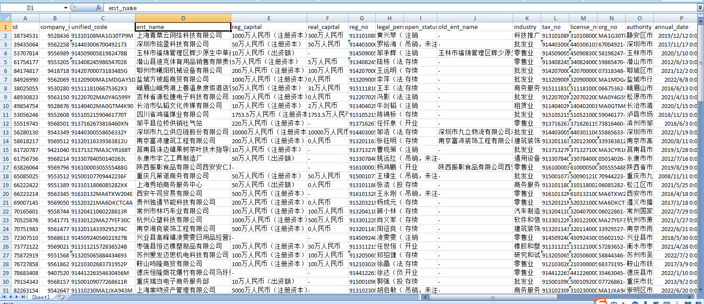

### 03 异常
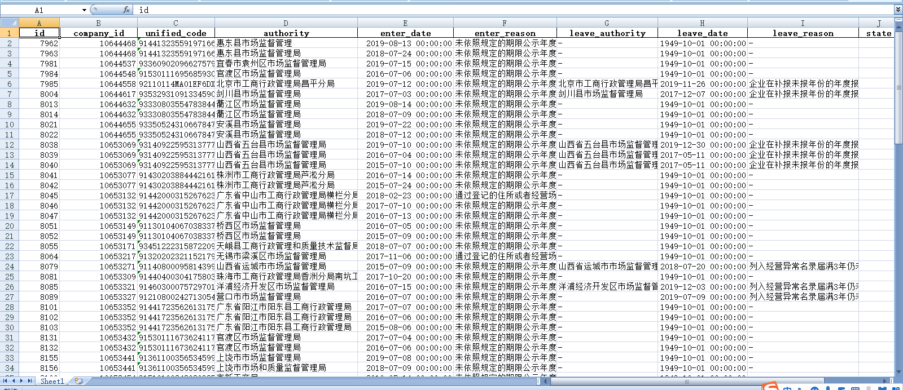
### 04 侵权
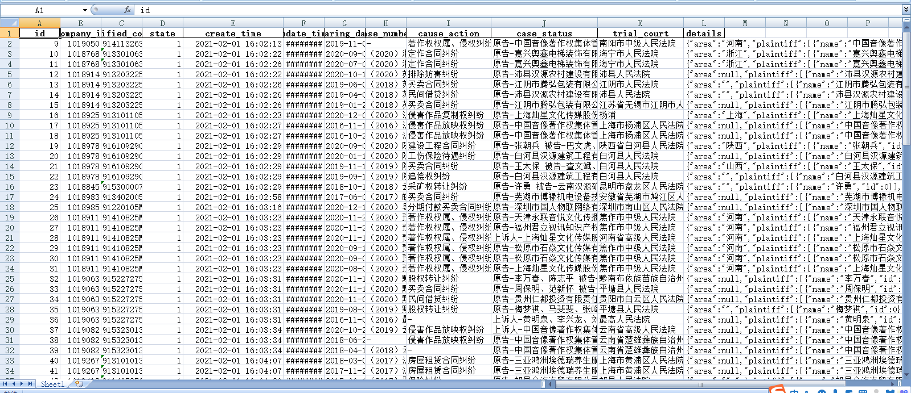
### 05 证书
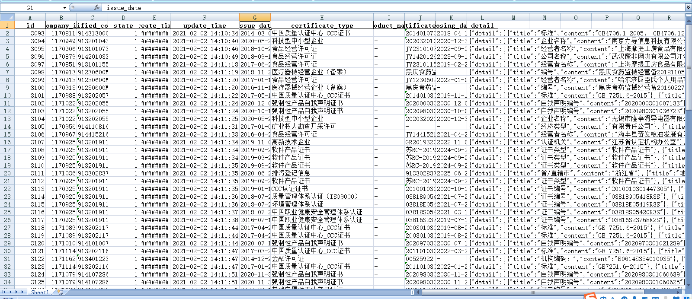
### 06 变更
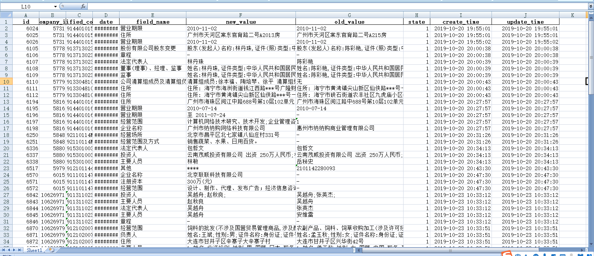
### 07 著作权
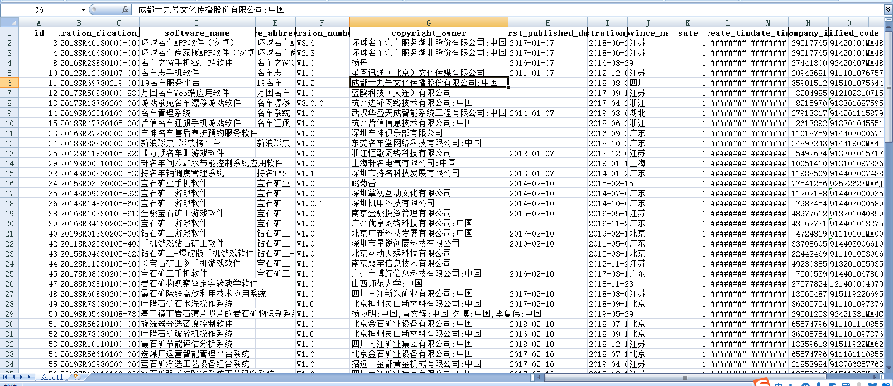
### 08 董事会
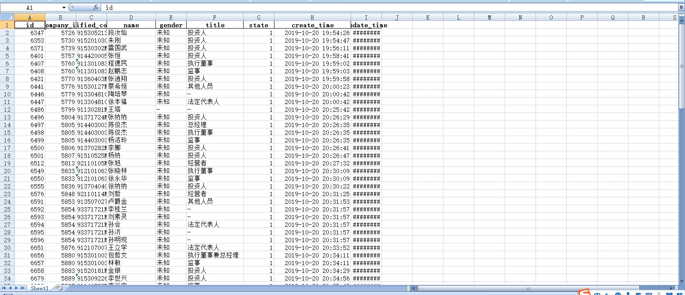
### 09 失信
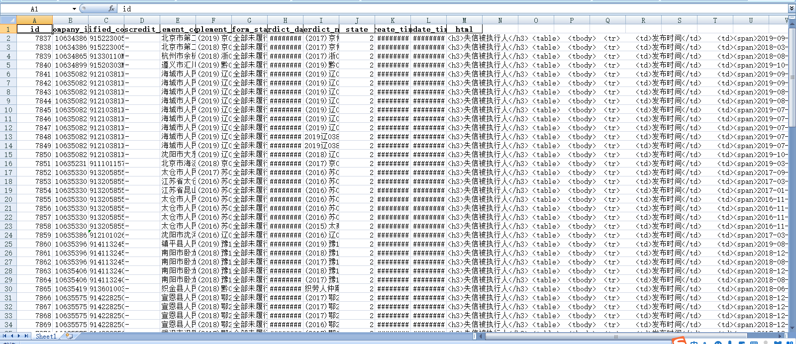
### 10 邮箱
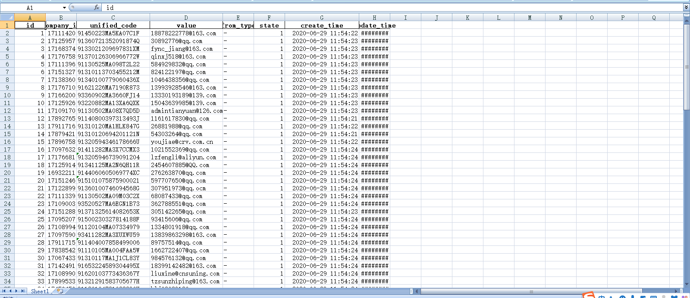
### 11 规模
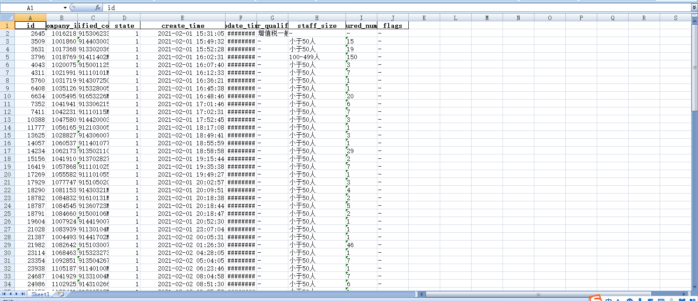
### 12 产品
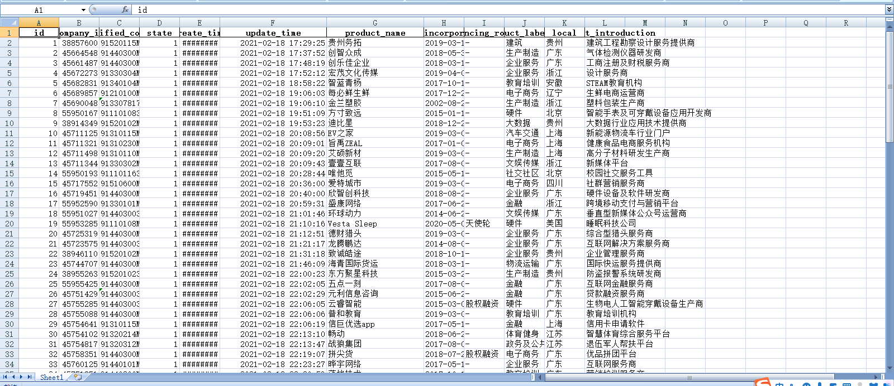
### 13 备案
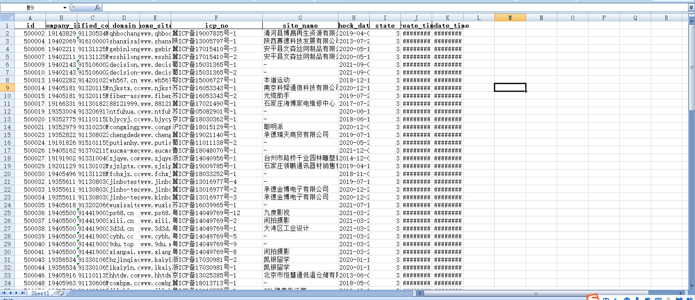
### 14 电话
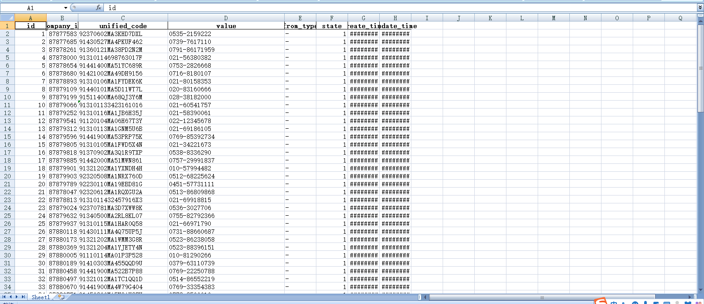
### 15 微信
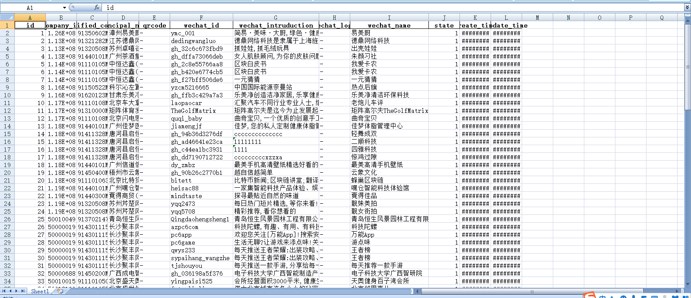

